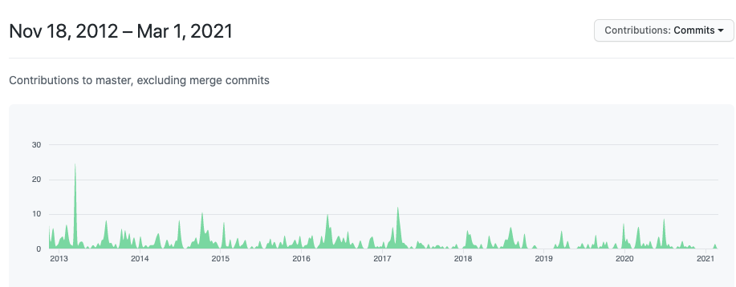
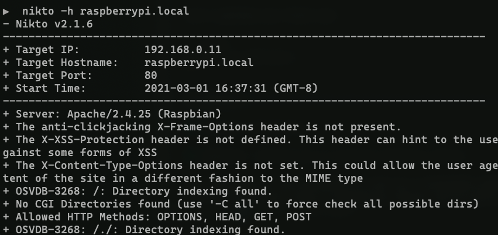
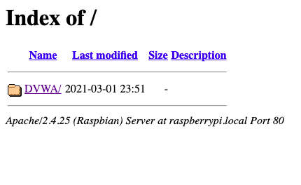
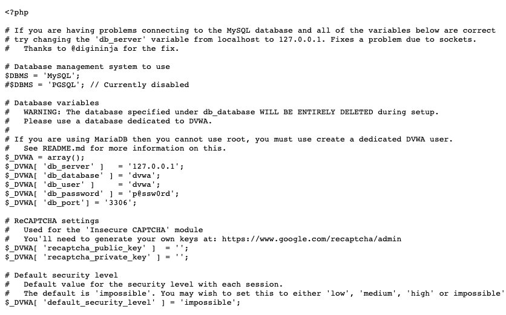
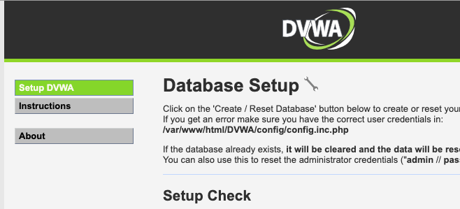

# Nikto Installation, Usage, and Introduction

Ryan Palo\
3/1/2021

Nikto is an open-source ([GPL License](https://www.gnu.org/licenses/licenses.html#GPL)) web server scanner tool.  Here are some quick links to reference:

- [Project Homepage](https://cirt.net/Nikto2)
- [GitHub Repository](https://github.com/sullo/nikto)
- [Documentation](https://cirt.net/nikto2-docs/)
- [Kali Linux Quick Description](https://tools.kali.org/information-gathering/nikto)

It's built with a modular database of common web server vulnerabilities, outdated versions, and problematic configuration options and designed to run a suite of tests against a web server, evaluate the responses, and alert the user to the presence of potentially vulnerable attack vectors.

The documentation notes that it is not, by design, a stealthy tool.  It's designed to run these tests quickly and provide results for a system that you own and are OK with probing.  That being said, it *does* offer built-in support for some evasion techniques powered by the Perl [LibWhisker](https://linux.die.net/man/3/lw2) module, using the `-evasion` flag (see the help snippet at the start of the [Basic Features](#basic-features) section below).

The database it's build on references something called the Open Source Vulnerability Data Base (OSVDB), but that's been shuttered due to lack of contributions.  However, the CVE website has a [general mapping](https://cve.mitre.org/data/refs/refmap/source-OSVDB.html) to CVE's that can be used for more research.

## History

The 1.00 version of Nikto was released in December of [2001](https://en.wikipedia.org/wiki/Nikto_(vulnerability_scanner)) by [Chris Sullo](https://cirt.net/sullo), who is one of the co-founders of the [Open Security Foundation](http://opensecurityfoundation.org/).  [David Lodge](https://cirt.net/dave) is also credited with maintenance and contributions.

Nikto currently got over 1300 commits on GitHub.  The 2.00 release happened in November of 2007 after six years of continuous work and bug fixes, and a hand-maintained [changelog](https://github.com/sullo/nikto/blob/master/program/docs/) was maintained until 2013.  After that, the GitHub commit history was used to track changes.  It currently has over 4600 stars on GitHub and has received commits from its creators consistently even up to this year.



*Source: GitHub.com*

At the date of this writing, they are currently on release version 2.1.6.

## Installation and Configuration

The installation instructions point to different methods depending on which source you're reading.  The official [documentation](https://cirt.net/nikto2-docs/) simply tell us to unpack the download file and make no mention of where to get it.

```shell
# Note, this won't do anything standalone.  Just copied here for completeness.
# Read on to see how to actually install it.
tar -xvfz nikto-current.tar.gz
```

The project homepage has a download link to the git repo master branch as a zip file, but that's not a released version, so you run the risk of downloading something actively being bugfixed.  We'll be using the official 2.1.6 release [download](https://github.com/sullo/nikto/releases) page.

There appear to be three main methods of installation, which we'll cover here in order of increasing convenience but also black-box-ness: downloading the source tarball, cloning the git repository, and installing via package manager.

### A Note on Prerequisites

The official documentation list out only one required prerequisite: a working installation of Perl.  Between this and difficulties installing OpenSSL, installing on either Mac or Linux is recommended because it's easier than installing on Windows.  However, you may get away with being able to make use of Windows Subsystem Linux on newer Windows machines.  That being said, here is a Windows install [guide](http://www.madirish.net/185) that seems to have all of the steps covered.

SSL support requires [Net::SSLeay](https://metacpan.org/pod/Net::SSLeay).  If you run Nikto after installing without this prerequisite, it will display a banner declaring you don't have SSL support.  You can install this with:

```shell
$ sudo cpan Net::SSLeay
```

*(Note: refer to Perl and CPAN documentation on how to install packages properly.  That's beyond the scope of this guide.)*

For logging to Metasploit, the [RPC::XML](https://metacpan.org/pod/XML::RPC) and [RPC::XML::Client](https://metacpan.org/pod/RPC::XML::Client) modules must also be installed.  As the documentation says, Nikto will work fine without them.  You'll just be missing the functionality.

### Install Via Release Tarball

The release tarball can be downloaded [here](https://github.com/sullo/nikto/archive/2.1.6.tar.gz).

```shell
$ wget https://github.com/sullo/nikto/archive/2.1.6.tar.gz
$ tar -xzf 2.1.6.tar.gz
$ ls
nikto-2.1.6
```
That's all it should take.  You should be able to run nikto from within the `program` directory:

```shell
$ cd nikto-2.1.6/program
$ ./nikto.pl
```

For some reason, if you try to run Nikto from any other directory, you run into Perl pathing problems, and it can't find the `plugins` directory.

### Install Via Git

This is the installation method recommended by the project's homepage as well as its GitHub README.  First, ensure you have git installed:

```shell
$ git --version
```

As long as it spits a version out, you should be good.  If not, refer to the git installation instructions for your OS.

Next, clone the repository.

```shell
$ git clone https://github.com/sullo/nikto
```

You should then be able to run it via:

```shell
$ nikto/program/nikto.pl
```

For some reason, Perl is able to find all of the plugins via this approach without having to run it from the same file.

### Install Via Package Manager

This is likely the easiest and least error prone method.  Depending on your operating system, install Nikto with whatever command is available to you.  Additionally, it appears that most package managers install the other prerequisites by default, meaning you won't have to deal with the headache of figuring out how and where to install SSL libraries or why the `nikto` command isn't on your path.

On Ubuntu, this was tested with:

```shell
$ sudo apt install nikto
```

On MacOS:

```shell
$ brew install nikto
```

You get the idea.

## Basic Features

You can run `man nikto` to see the manual page for longer, more detailed descriptions of what each of the options does.  This is probably your best reference.  For a short, quick refresher, `nikto -H` shows the short help.  This short help will be shown anytime you give a bad input as well, so simply running `nikto` is an easy shortcut--even if it does yell at you for incorrect usage.

Now we're actually going to get some usage out of Nikto.  If you have a webserver you own and want to test against, go right ahead.  If you don't, the Appendix describes how to quickly get a purposefully vulnerable web application installed and running on your Linux box.  

*Note: You should never run robotic scans against webservers you don't own or have explicit permission to scan.  How would you like it people came over and started hitting your house with a hammer?*

The following commands are assuming the web server is running on your local machine, but if it's on another machine, replace all instances of the IP address 127.0.0.1 with your web server's IP address.

### Basic Testing

Let's perform our first run:

```shell
$ nikto -h 127.0.0.1
```

It should output some diagnostic output and then start listing off any vulnerabilities it finds.



You'll notice a lot of mentions of "directory indexing found."  This is when the web server is configured such that, if there is no `index.html` file in place, to show a listing of all the files in the directory.  It's usually something you should turn off.  If you open a browser to `127.0.0.1`, you'll see something like this:



Nothing surprising, it just shows the DVWA directory, but, it also shows the server and version you're running, which was maybe information a hacker didn't know before.

### Changing Root Directories

Our first scan didn't show us a whole lot besides directory indexing, though.  What we actually want to scan is the DVWA itself.  Nikto allows us to do that with the `-root` option which lets us specify a subdirectory to use as root for our tests.

```shell
$ nikto -h 127.0.0.1 -root /DVWA
```

This lists a few more interesting urls to try.  Apparently the .git directory is available.  Also, the `/DVWA/config` directory is viewable.  Let's see what's in there!  A quick click on the documents inside show that someone left the default database configuration in there (it was us).



Maybe not the most interesting, but someone that careless may have also forgotten to change the default passwords.

## Personal Evaluation

Nikto is really neat!  It seems like a great first pass tool to see if there are any easy vulnerabilities.  We've only just scratched the surface of what it can do.  There are lots of complicated scripting options available that I want to dive into but which are probably too long for a 15-20 minute presentation.

I will say that it's only as powerful as its user is.  It's not an automated cracking tool that you can throw at a server without knowing what you're doing.  It's a tool that will provide you with intelligent information that you have to know how to use, what are actual vulnerabilities, and what are only false alarms.  And honestly, that's my favorite kind of tool.  The smaller the amount of opaque magic, the better.

## Appendix: Setting Up an Insecure Practice Server

The following is the procedure to set up a vulnerable web application and server if you don't have a production server you're willing to try Nikto out on.  We'll make use of the [Damn Vulnerable Web Application](https://dvwa.co.uk/) (DVWA), because it's relatively easy to set up and has plenty of vulnerabilities to look at once we get going with Nikto.  The following instructions assume a Debian-based operating system.  Aside from the package manager commands, the rest of the commands should likely carry over for most Linux machines.  Linked is a [blog post](https://medium.datadriveninvestor.com/setup-install-dvwa-into-your-linux-distribution-d76dc3b80357) with more complete instructions if you get stuck.  Also, make sure you reference the [DVWA GitHub page](https://github.com/digininja/DVWA).

First, we'll install prerequisites:

```shell
$ sudo apt install apache2 mariadb-server php php-mysqli php-gd libapache2-mod-php
```

This installs Apache, MySQL, and PHP, along with the interfaces between them.

Next we'll clear out our web directory and download the app.

```shell
$ cd /var/www/html
$ rm index.html
$ git clone https://github.com/digininja/DVWA.git
$ cd DVWA/config
$ cp config.inc.php.dist config.inc.php
```

At this point, if you're running the server on your own computer, you can go to localhost in your browser.  Otherwise, go to the IP address of your server.  You should see the DVWA status check/setup page:



So far so good.  The last thing to do is to configure the `dvwa` user on the database.  Log into your server as the root user:

```shell
$ sudo mysql
Welcome to the MariaDB monitor.  Commands end with ; or \g.
Your MariaDB connection id is 39
Server version: 10.1.48-MariaDB-0+deb9u1 Raspbian 9.11

Copyright (c) 2000, 2018, Oracle, MariaDB Corporation Ab and others.

Type 'help;' or '\h' for help. Type '\c' to clear the current input statement.

MariaDB [(none)]> create database dvwa;
Query OK, 1 row affected (0.00 sec)

MariaDB [(none)]> create user dvwa@localhost identified by 'p@ssw0rd';
Query OK, 0 rows affected (0.01 sec)

MariaDB [(none)]> grant all on dvwa.* to dvwa@localhost;
Query OK, 0 rows affected (0.01 sec)

MariaDB [(none)]> flush privileges;
Query OK, 0 rows affected (0.00 sec)

MariaDB [(none)]> exit
Bye
```

If you return to `localhost/DVWA` and click the "Reset Database" button at the bottom, it should say good things about creating databases correctly.  There will be some items that haven't been properly configured if you actually wanted to go through the DVWA modules, but for just scanning it with Nikto, it should be good to go!
